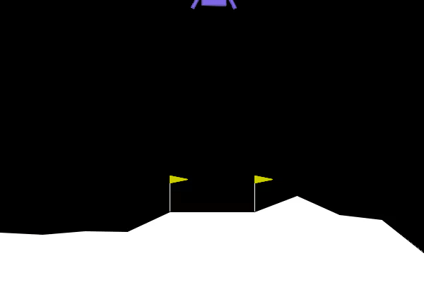
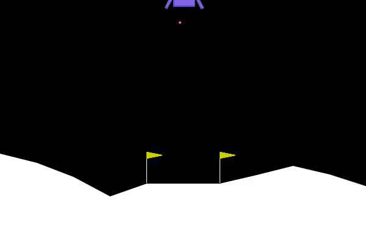
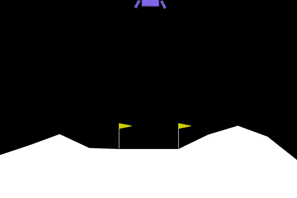

## Repo Containing HW11 Moon Lander

This repo contains the work related to HW 11. This is the moonlander HW and becuase I couldn't setup the Jetson I ran this lab using a nvidea g4dn instance to perform the model train/eval.


## Commnads:


```
# build docker container for training
docker build -t hw11 -f Dockerfile.4.4 .
```

```
time docker run -it --rm --net=host --shm-size=2048m --gpus all -e DISPLAY=$DISPLAY -v /tmp/.X11-unix/:/tmp/.X11-unix:rw --privileged -v /data/videos:/tmp/videos hw11
```

```
rename *.h5 file to mymodel.h5
# build docker container for testing
docker build -t testlander -f Dockerfile.test .
```

```
# start testing
time docker run -it --rm --net=host --gpus all --shm-size=2048m -e DISPLAY=$DISPLAY -v /tmp/.X11-unix/:/tmp/.X11-unix:rw --privileged -v /data/videos:/tmp/videos testlander
```


## 1. What parameters did you change?
- update the 'self.density_first_layer' to various values and eventually increased it to 512. Increasing this values increases the models ability to solve an increasingly more complex problems.
- update the 'self.density_second_layer' to 256 by the third run (this also increases the models ability to solve more complex problems)
- Loss function: 'mean_absolute_error' this measures the reward system of the landing reinforcement model.


## 2. What values did you try?
```
values tried (Iter1, Iter2, Iter3): 
layer_1: 32, 256, 512
layer_2: 16, 128, 256
batch_size: 32, 64, 64

epsilon_decay: .995, .999, .995
gamma: .99, .95, .99
```
## 3. Did you try any other changes that made things better or worse?
Most of my changes were in these values above. I noticed that when I decreased the gamme adn increased the epsilon_decay there was a decrease in model performance. The model took significantly longer to train and have the rewards above 200 when I was using first two models. The Iter1 model performed very poorly and was not able to get the model to land after 750 runs. 


### Attempt1:



Result:

```
99      : Episode || Reward:  73.331
Average Reward:  -17.7334
Total tests above 200:  6

real    38m14.231s
user    0m1.349s
sys     0m2.477s
```

### Attempt2:



Result:

```
Result:
99      : Episode || Reward:  280.9333857208883
Average Reward:  252.38470130078443
Total tests above 200:  98

real    21m14.231s
user    0m1.349s
sys     0m2.477s
```


### Attempt3:



```
99      : Episode || Reward:  186.36790646279343
Average Reward:  203.04847813525652
Total tests above 200:  54

real    41m6.251s
user    0m2.564s
sys     0m4.035s
```

## 4. Did they improve or degrade the model? Did you have a test run with 100% of the scores above 200?

The changes that I made didnt all improve the model going into the second iteration (but the net impact was positive). Overall I noticed the model performing better as I increased the size of the first and second layers. I also noticed an improvement by increased the batch size to 64. 

## 5. Based on what you observed, what conclusions can you draw about the different parameters and their values?

Increasing the first and second layers greatly increases the complexity of problems the model can solve. Increasing the nodes didn't always improve model performance and it is important to optimize the episolon decay in order to ensure randomness in the model. 

## 6. What is the purpose of the epsilon value?

- The episolon value is the prob of selecting a random state rather than the highest Q-score

- It allows the model to be more eperimentive and explore the state space. As the model improves the episolon value is decreased to reduce randomness.

## 7. Describe "Q-Learning".

- Type of reinforcement learning using Q-table in memory
- Each state action will have a corrosponding Q-value or reward
- The model looks to get the best action at a given state
- The environment will provide multiple states to the agent for it to select
- You want the agent to be trained to maximize the reards from the policy
